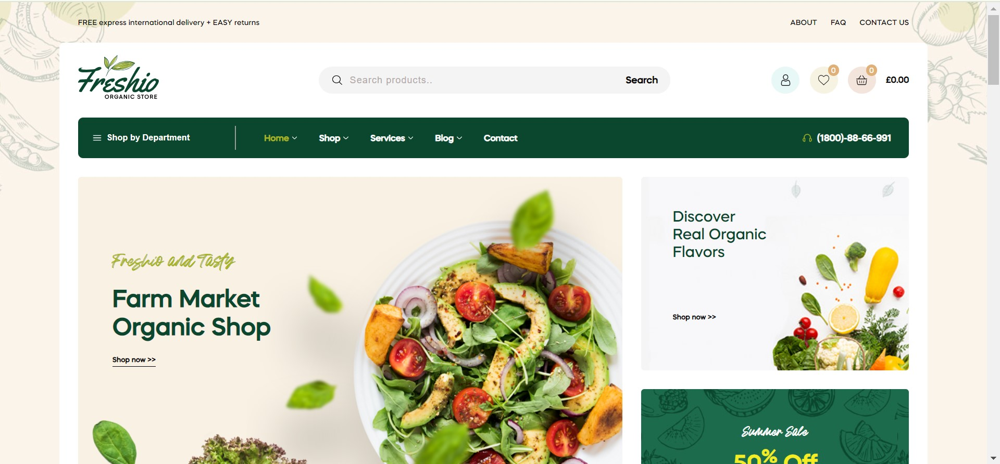
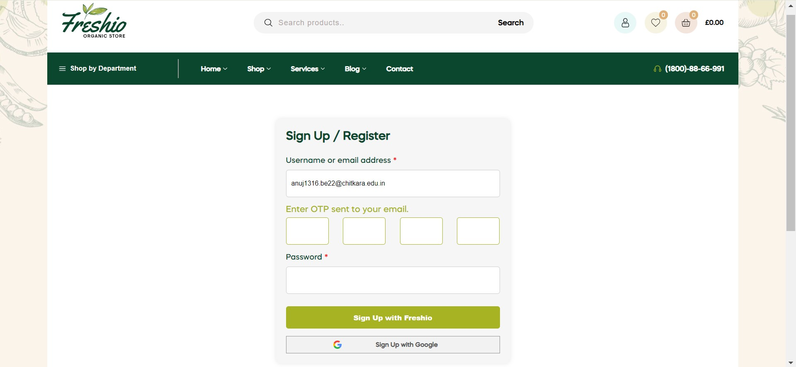
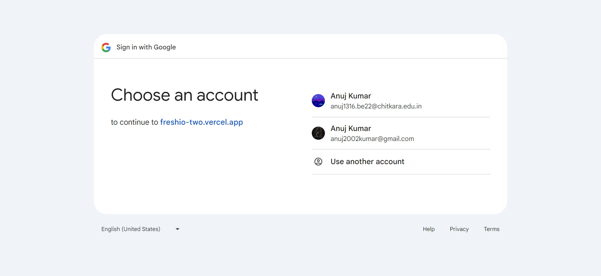
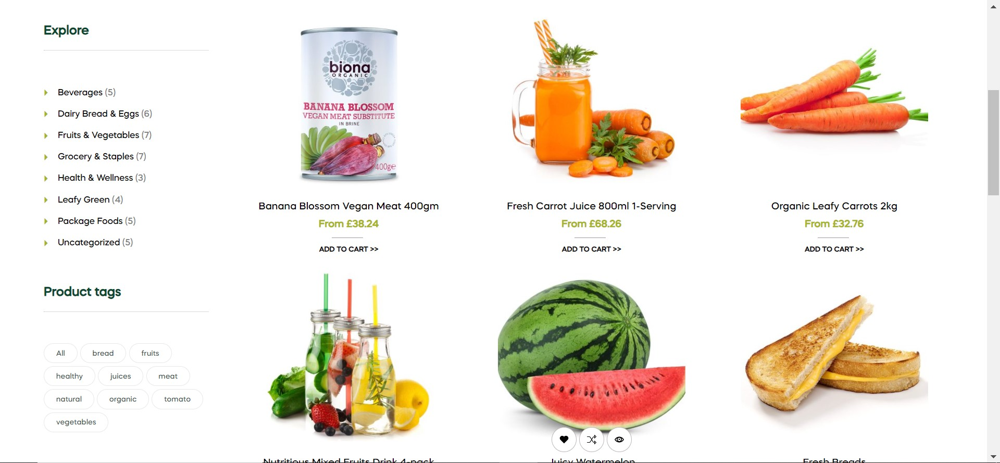
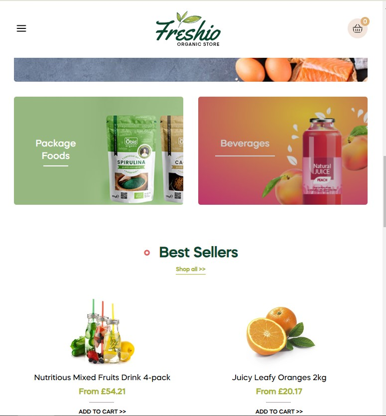

# 🍏 Freshio Organic Store



## 📝 Overview

Freshio is an e-commerce website specializing in organic fruits and vegetables. This project is built using HTML, CSS, JavaScript, EJS, Node.js, Express.js, and PostgreSQL. It incorporates several security features such as OTP-based authentication, Google OAuth and email verification using OTP. The website also includes filtering and searching functionalities and has been designed with a responsive layout for optimal viewing on various devices.

## ✨ Features

### 🔒 OTP-based Authentication
Secure login and verification using one-time passwords to ensure user safety.



### 🔑 Google OAuth
Email verification through Google OAuth with OTP to streamline user registration and login.



### 🔍 Filtering and Searching
Efficient product filtering and searching capabilities for a seamless shopping experience.



### 📱 Responsive Design
A responsive layout that ensures a seamless experience across desktop and mobile devices.



## 🛠️ Tech Stack

- **Frontend:** HTML, CSS, JavaScript, EJS
- **Backend:** Node.js, Express.js
- **Database:** PostgreSQL

## 🚀 Installation

1. Clone the repository:

Use the following command to clone the repository to your local machine. Make sure to add the env file to the freshio directory.


 ```bash
   git clone https://github.com/httpsanuj1807/Freshio-Full-Stack-Ecommerce.git
   cd freshio
   ```

``` bash
#  add these field in env file
SESSION_SECRET
PG_HOST
PG_USER
PG_PASSWORD
PG_DATABASE
PG_PORT
GOOGLE_CLIENT_ID
GOOGLE_CLIENT_SECRET
GOOGLE_ID
GOOGLE_ACCOUNT_PASSWORD
```

  
2. Intall the dependencies:
```bash
npm install
   ``` 
3. Start the server and visit localhost:3000 in your browser
```bash
npm run start
   ``` 

   
## 🌎 Contact

[](https://github.com/httpsanuj1807)
[](https://www.linkedin.com/in/anuj-kumar-7837a9268)
[](https://www.instagram.com/https_anuj1807)